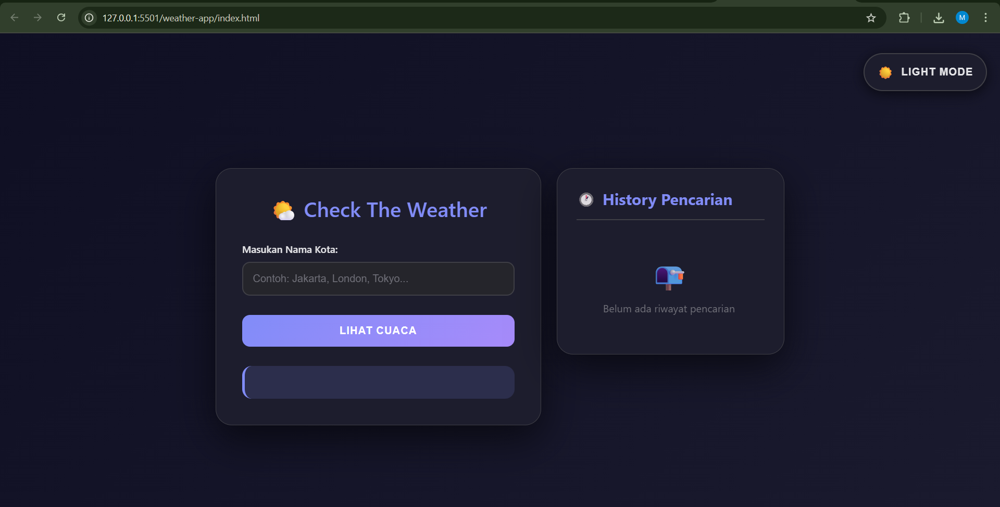
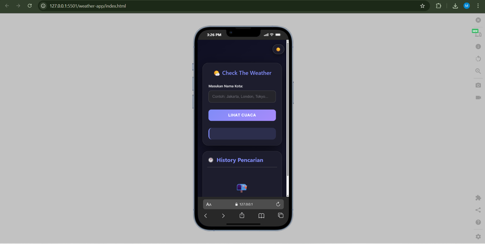

# 🌤️ Weather App

A simple and responsive weather application built with **HTML**, **CSS**, and **JavaScript** that displays real-time weather data using the **OpenWeatherMap API**.

## ✨ Features

- 🔍 Search weather by city name
- 🌡️ Show temperature, humidity, and weather description
- 🎨 Dynamic weather icons
- 📊 Display detailed weather information (wind speed, pressure, feels like)
- 📅 Display 5-day weather forecast
- 💾 Save weather search history with localStorage
- 🌓 Automatic dark/light mode based on time
- 🎯 Manual theme toggle
- 📱 Fully responsive design
- ⚡ Fast and lightweight

## 🧠 Technologies Used

- HTML5
- CSS3 (CSS Variables, Grid, Flexbox)
- JavaScript ES6+ (Fetch API, Async-Await, LocalStorage)
- OpenWeatherMap API

## 📁 Project Structure
```
weather-app/
├── js/
│   ├── api.js           # API configuration and fetch functions
│   ├── forecast.js      # 5-day forecast logic
│   ├── history.js       # Search history management
│   ├── main.js          # Main application logic
│   └── theme.js         # Theme toggle (dark/light mode)
├── style/
│   └── styles.css       # All styling and responsive design
├── index.html           # Main HTML file
└── README.md            # Project documentation
```

## 🌐 API Documentation

This application uses the **OpenWeatherMap API** to fetch weather data.

### API Endpoints Used:

1. **Current Weather Data**
```
   https://api.openweathermap.org/data/2.5/weather?q={city}&appid={API_KEY}&units=metric
```
   - Documentation: [Current Weather API](https://openweathermap.org/current)

2. **5-Day Weather Forecast**
```
   https://api.openweathermap.org/data/2.5/forecast?q={city}&appid={API_KEY}&units=metric
```
   - Documentation: [5 Day Forecast API](https://openweathermap.org/forecast5)

### Get Your API Key:

1. Visit [OpenWeatherMap](https://openweathermap.org/)
2. Sign up for a free account
3. Navigate to **API Keys** section
4. Copy your API key
5. Replace `YOUR_API_KEY` in `js/api.js` with your actual API key
```javascript
// js/api.js
const apiKey = "YOUR_API_KEY_HERE";
```

## 🚀 How to Run

1. **Clone this repository**
```bash
   git clone https://github.com/MuhammadChairulHamsy/weather-app.git
```

2. **Navigate to project directory**
```bash
   cd weather-app
```

3. **Get your OpenWeatherMap API Key**
   - Sign up at [OpenWeatherMap](https://openweathermap.org/api)
   - Copy your API key

4. **Add your API Key**
   - Open `js/api.js`
   - Replace `YOUR_API_KEY` with your actual API key

5. **Open the application**
   - Simply open `index.html` in your web browser
   - Or use a local server:
```bash
     # Using Python
     python -m http.server 8000
     
     # Using Node.js (http-server)
     npx http-server
     
     # Using VS Code Live Server extension
     Right-click index.html > Open with Live Server
```

6. **Start searching!**
   - Enter a city name (e.g., "Jakarta", "London", "Tokyo")
   - Click "Lihat Cuaca" or press Enter
   - View current weather and 5-day forecast

## 📸 Screenshots

### Light Mode


### Dark Mode


### Mobile View


## 🎯 Features Breakdown

### 1. Current Weather Display
- Real-time temperature
- Weather description with icons
- Feels like temperature
- Humidity percentage
- Wind speed
- Atmospheric pressure
- Geographic coordinates

### 2. 5-Day Forecast
- Daily weather predictions
- Temperature trends
- Weather conditions
- Interactive cards

### 3. Search History
- Stores last 10 searches
- Click to search again
- Delete individual entries
- Clear all history option
- Persists across sessions

### 4. Theme System
- Auto-detect based on time (6 PM - 6 AM = Dark Mode)
- Manual toggle switch
- Smooth transitions
- Saves user preference

## 🛠️ Customization

### Change Temperature Unit
```javascript
// In js/api.js
// For Fahrenheit: units=imperial
// For Celsius: units=metric
const baseUrl = "https://api.openweathermap.org/data/2.5/weather";
```

### Modify Theme Colors
```css
/* In style/styles.css */
:root {
  --accent-color: #667eea; /* Change primary color */
  --accent-secondary: #764ba2; /* Change secondary color */
}
```

### Adjust History Limit
```javascript
// In js/history.js
if (history.length > 10) history.pop(); // Change 10 to your preferred limit
```

## 🐛 Troubleshooting

### "Kota tidak ditemukan" Error
- Check your internet connection
- Verify city name spelling
- Ensure API key is valid

### API Key Not Working
- Make sure you've activated your API key (can take a few minutes)
- Check if you've exceeded free tier limits (60 calls/minute)
- Verify the API key is correctly pasted

### Dark Mode Not Working
- Clear browser cache and localStorage
- Check browser console for errors

## 📚 Learning Resources

- [OpenWeatherMap API Documentation](https://openweathermap.org/api)
- [MDN Web Docs - Fetch API](https://developer.mozilla.org/en-US/docs/Web/API/Fetch_API)
- [CSS Variables Guide](https://developer.mozilla.org/en-US/docs/Web/CSS/Using_CSS_custom_properties)
- [JavaScript Async/Await](https://developer.mozilla.org/en-US/docs/Web/JavaScript/Reference/Statements/async_function)

## 🤝 Contributing

Contributions are welcome! Please feel free to submit a Pull Request.

1. Fork the project
2. Create your feature branch (`git checkout -b feature/AmazingFeature`)
3. Commit your changes (`git commit -m 'Add some AmazingFeature'`)
4. Push to the branch (`git push origin feature/AmazingFeature`)
5. Open a Pull Request

## 📝 License

This project is open source and available under the [MIT License](LICENSE).

## 👨‍💻 Author

**Muhammad Chairul Hamsy**

- GitHub: [@MuhammadChairulHamsy](https://github.com/MuhammadChairulHamsy)
- Project Link: [https://github.com/MuhammadChairulHamsy/weather-app](https://github.com/MuhammadChairulHamsy/weather-app)

## 🙏 Acknowledgments

- Weather data provided by [OpenWeatherMap](https://openweathermap.org/)
- Icons from emoji set
- Inspiration from modern weather applications

---

Made with ❤️ by Muhammad Chairul Hamsy